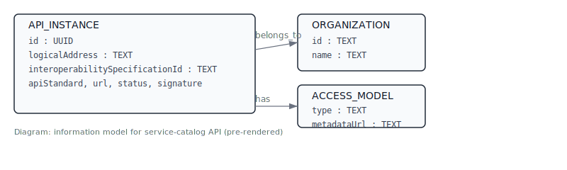

[1. Build and run locally](#sec-1-build-and-run-locally)

[2. Example endpoints](#sec-2-example-endpoints)

[3. Environment variables](#sec-3-environment-variables)

[4. Information model (pre-rendered)](#sec-4-information-model-pre-rendered)


<a id="doc-perl-api-for-service-catalog"></a>
# Perl API for Service Catalog


<a id="sec-1-build-and-run-locally"></a>
## 1. Build and run locally

This directory contains a simple OO-Perl implementation of the OpenAPI in `openapi/service-catalog-openapi.yaml`.

Build and run locally (example using docker-compose file in repo root named `docker-compose.perl-api.yml`):

```powershell
Set-Location 'c:\dev\workspace\interop-infrastructure'
docker-compose -f docker-compose.perl-api.yml up --build
```

<a id="sec-2-example-endpoints"></a>
## 2. Example endpoints

The API will listen on port 5000. Example endpoints:
- GET /apis?logicalAddress={}&interoperabilitySpecificationId={}
- POST /apis
- GET /apis/{id}
- PUT /apis/{id}
- DELETE /apis/{id}
- GET /sync/apis

<a id="sec-3-environment-variables"></a>
## 3. Environment variables

Environment variables used for DB connection:
- DB_HOST, DB_PORT, DB_NAME, DB_USER, DB_PASS

<a id="sec-4-information-model-pre-rendered"></a>
## 4. Information model (pre-rendered)

Below is the API information model rendered to SVG. The image is pre-rendered and checked into the repository so it displays even when Mermaid is not supported by your viewer.



To regenerate the SVG from the Mermaid source (`perl-api/docs/info-model.mmd`) run the repository helper:

```powershell
.
\scripts\render-mermaid.ps1
```
