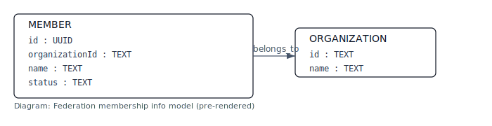

[1. Key points](#sec-1-key-points)

[2. Endpoints (examples)](#sec-2-endpoints-examples)

[3. Information model (pre-rendered)](#sec-3-information-model-pre-rendered)

[4. How it's exposed in the compose stack](#sec-4-how-it-s-exposed-in-the-compose-stack)

[5. Database notes](#sec-5-database-notes)

[6. Running tests and OpenAPI](#sec-6-running-tests-and-openapi)

[7. Quick curl examples (via Kong)](#sec-7-quick-curl-examples-via-kong)

[8. Notes for developers](#sec-8-notes-for-developers)

[9. Contact](#sec-9-contact)


<a id="doc-federation-membership-service-perl-federation"></a>
# Federation membership service (perl-federation)

<a id="sec-1-key-points"></a>
## 1. Key points

- Service: `perl-federation` (Perl/Dancer2, PSGI)
- Intended to be backend-only and proxied via Kong at `/federation`
- OpenAPI doc: `openapi/federation-membership-api.html` (served by the `openapi` static server and visible in the admin UI under the APIs tab)
- DB table: `members` (see `service-catalog-db/migrations/0001_create_members.sql`)

<a id="sec-2-endpoints-examples"></a>
## 2. Endpoints (examples)

- GET /_ping
  - Lightweight health endpoint that returns { ok: 1, now: "..." }
- GET /members
  - Returns a JSON list of federation members (empty array if none)
- POST /members
  - Create a member, body JSON: { organizationId: "org1", name: "Member name", status: "active" }
- GET /members/:id
- PUT /members/:id
- DELETE /members/:id

<a id="sec-3-information-model-pre-rendered"></a>
## 3. Information model (pre-rendered)

This service includes a pre-rendered SVG of the federation membership information model. The diagram is committed under `perl-federation/docs/images/info-model.svg` and will display in most Markdown viewers.



To regenerate from the Mermaid source (`perl-federation/docs/info-model.mmd`) run:

```powershell
.\scripts\render-mermaid.ps1
```

<a id="sec-4-how-it-s-exposed-in-the-compose-stack"></a>
## 4. How it's exposed in the compose stack

- The service is declared in `docker-compose.yml` as `federation` and is attached to the `backend` network. It is reachable inside the Compose/Kong network at `http://federation:5001`.
- Kong declarative config (`kong.yml`) maps the public path `/federation` to the upstream `http://federation:5001` and strips the prefix before proxying to the service.
- For local development the recommended access is via Kong through the public proxy:
  - Example: `http://localhost:8080/federation/_ping`
  - Example: `http://localhost:8080/federation/members`

<a id="sec-5-database-notes"></a>
## 5. Database notes

- The required table `members` is created by migration `service-catalog-db/migrations/0001_create_members.sql`.
- If your DB volume existed before the migration was added, run the migration helper to apply it to the running DB container:

```powershell
cd C:\dev\workspace\interop-infrastructure
.\scripts\apply-db-migrations.ps1
```

<a id="sec-6-running-tests-and-openapi"></a>
## 6. Running tests and OpenAPI

- The admin web UI lists the Federation OpenAPI under the APIs tab and serves the static OpenAPI HTML at `/openapi/federation-membership-api.html`.
- The admin-web test-runner includes federation CRUD tests and will run them when invoked via `GET /api/run-tests` (proxied via Kong at `http://localhost:8080/api/run-tests`).

<a id="sec-7-quick-curl-examples-via-kong"></a>
## 7. Quick curl examples (via Kong)

```powershell
# 2. ping
curl http://localhost:8080/federation/_ping

# 3. list members
curl http://localhost:8080/federation/members

# 4. create a member
curl -X POST http://localhost:8080/federation/members -H "Content-Type: application/json" -d '{"organizationId":"org1","name":"Test Member","status":"active"}'
```

<a id="sec-8-notes-for-developers"></a>
## 8. Notes for developers

- The service code lives in `perl-federation/` and contains a Dancer2 PSGI app and a small model layer that uses DBI/DBD::Pg.
- The container image is built by the top-level `docker-compose.yml` and is intended to be backend-only; if you need to debug the service from the host you can temporarily add a `ports:` mapping in a local copy of `docker-compose.yml` (not recommended for shared setups).

<a id="sec-9-contact"></a>
## 9. Contact

If you want the service tightened (input validation, pagination, authentication) I can add example validators and tests; tell me which features you prefer.
